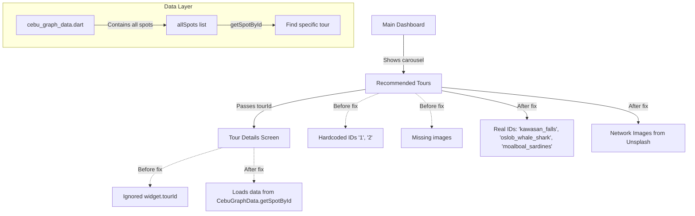
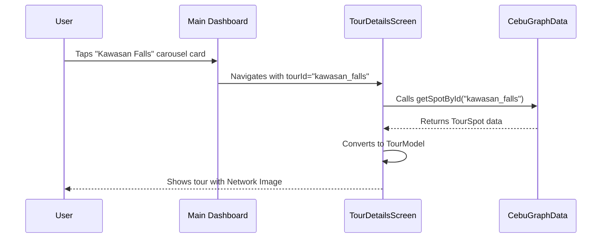

# Implementation Plan: Fix Recommended Tours Carousel

## Overview
This plan addresses the broken navigation and missing images in the "Recommended Tours" carousel by:
1. Adding missing tour data to the repository
2. Linking the dashboard to real data IDs
3. Making the tour details screen load dynamic data

## Architecture Diagram



## Step-by-Step Implementation

### STEP 1: Add Missing Data to cebu_graph_data.dart

**File:** `lib/data/cebu_graph_data.dart`

**Change:** Append two new `TourSpot` objects to `allSpots` list:

```dart
// Add before closing ]; of allSpots
TourSpot(
  id: 'kawasan_falls',
  name: 'Kawasan Falls Canyoneering',
  description: 'Experience the thrill of jumping, swimming, and trekking through the stunning Kawasan Falls canyon.',
  coordinate: GeoCoordinate(latitude: 9.8038, longitude: 123.3735),
  category: TourSpotCategory.natural,
  imageUrl: 'https://images.unsplash.com/photo-1518509562904-e7ef99cdcc86?q=80&w=1000&auto=format&fit=crop',
  estimatedDurationMinutes: 240,
  isOpen: true,
  operatingHours: '06:00-15:00',
  entranceFee: 1500,
),
TourSpot(
  id: 'moalboal_sardines',
  name: 'Moalboal Sardine Run',
  description: 'Snorkel with millions of sardines in the world-famous sardine run just off the shore.',
  coordinate: GeoCoordinate(latitude: 9.9546, longitude: 123.3999),
  category: TourSpotCategory.natural,
  imageUrl: 'https://images.unsplash.com/photo-1544551763-46a013bb70d5?q=80&w=1000&auto=format&fit=crop',
  estimatedDurationMinutes: 120,
  isOpen: true,
  operatingHours: '06:00-17:00',
  entranceFee: 0,
),
```

### STEP 2: Update main_dashboard.dart

**File:** `lib/screens/home/main_dashboard.dart`

**Action 1:** Replace `_recommendedTours` with matching IDs:

```dart
final List<Map<String, dynamic>> _recommendedTours = [
  {
    'id': 'kawasan_falls',
    'title': 'Kawasan Falls Canyoneering',
    'location': 'Badian, Cebu',
    'price': 2500.0,
    'rating': 4.9,
    'image': 'https://images.unsplash.com/photo-1518509562904-e7ef99cdcc86?q=80&w=1000&auto=format&fit=crop',
    'duration': '8 hours',
    'guide': 'Juan dela Cruz',
    'description': 'Experience the thrill of jumping, swimming, and trekking.',
  },
  {
    'id': 'oslob_whale_shark',
    'title': 'Oslob Whale Shark Encounter',
    'location': 'Oslob, Cebu',
    'price': 3500.0,
    'rating': 4.8,
    'image': 'https://images.unsplash.com/photo-1582967788606-a171f1080ca8?q=80&w=1000&auto=format&fit=crop',
    'duration': '10 hours',
    'guide': 'Maria Santos',
    'description': 'Swim with gentle whale sharks in crystal-clear waters.',
  },
  {
    'id': 'moalboal_sardines',
    'title': 'Moalboal Sardine Run',
    'location': 'Moalboal, Cebu',
    'price': 1800.0,
    'rating': 4.7,
    'image': 'https://images.unsplash.com/photo-1544551763-46a013bb70d5?q=80&w=1000&auto=format&fit=crop',
    'duration': '4 hours',
    'guide': 'Pedro Penduko',
    'description': 'Snorkel with millions of sardines.',
  },
];
```

**Action 2:** Replace the image Container's decoration in CarouselSlider:

```dart
// Replace current Container decoration with:
decoration: BoxDecoration(
  color: AppTheme.primaryColor.withOpacity(0.2),
  borderRadius: const BorderRadius.vertical(top: Radius.circular(16)),
  image: DecorationImage(
    image: (tour['image'] as String).startsWith('http')
        ? NetworkImage(tour['image'])
        : AssetImage('assets/images/${tour['image']}') as ImageProvider,
    fit: BoxFit.cover,
  ),
),
```

### STEP 3: Update tour_details_screen.dart

**File:** `lib/screens/tour/tour_details_screen.dart`

**Action 1:** Add import:
```dart
import 'package:tourmate_app/data/cebu_graph_data.dart';
```

**Action 2:** Replace `_TourDetailsScreenState` class:

```dart
class _TourDetailsScreenState extends State<TourDetailsScreen> {
  late TourModel tourData;
  bool isLoading = true;
  
  List<UserModel> guides = [];
  bool isLoadingGuides = false;
  UserModel? selectedGuide;

  @override
  void initState() {
    super.initState();
    _loadTourData();
    _fetchGuides();
  }

  void _loadTourData() {
    final spot = CebuGraphData.getSpotById(widget.tourId);
    
    if (spot != null) {
      setState(() {
        tourData = TourModel(
          id: spot.id,
          title: spot.name,
          description: spot.description,
          price: spot.entranceFee > 0 ? spot.entranceFee + 1500.0 : 1500.0,
          category: [spot.category.toString().split('.').last],
          maxParticipants: 12,
          currentParticipants: 0,
          startTime: DateTime.now().add(const Duration(days: 1)),
          endTime: DateTime.now().add(const Duration(days: 1, hours: 8)),
          meetingPoint: '${spot.name} Entrance',
          mediaURL: [spot.imageUrl],
          createdBy: 'guide_1',
          shared: true,
          itinerary: [],
          status: 'published',
          duration: spot.estimatedDurationMinutes ~/ 60,
          languages: ['English', 'Tagalog'],
          specializations: ['Culture', 'History'],
        );
        isLoading = false;
      });
    } else {
      setState(() {
        tourData = TourModel(
          id: '1', 
          title: 'Kawasan Falls (Default)', 
          description: 'Could not load tour details.',
          price: 2500.0,
          category: ['Adventure'],
          mediaURL: ['https://images.unsplash.com/photo-1518509562904-e7ef99cdcc86?q=80&w=1000'],
          createdBy: 'guide1',
          status: 'published',
          duration: 8,
          startTime: DateTime.now(),
          endTime: DateTime.now(),
          meetingPoint: 'Cebu',
        );
        isLoading = false;
      });
    }
  }

  // Keep existing _fetchGuides, _showGuideSelectionDialog methods
  // ...
}
```

**Action 3:** Update the SliverAppBar flexibleSpace image section:

```dart
// Replace gradient Container with:
decoration: BoxDecoration(
  image: DecorationImage(
    image: tourData.mediaURL.first.startsWith('http')
        ? NetworkImage(tourData.mediaURL.first)
        : AssetImage('assets/images/${tourData.mediaURL.first}') as ImageProvider,
    fit: BoxFit.cover,
  ),
),
```

## Expected Behavior After Fix



## Files Modified
1. `lib/data/cebu_graph_data.dart` - Added 2 new TourSpot objects
2. `lib/screens/home/main_dashboard.dart` - Updated IDs and image rendering
3. `lib/screens/tour/tour_details_screen.dart` - Dynamic data loading
